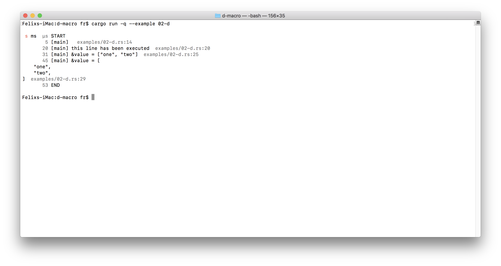
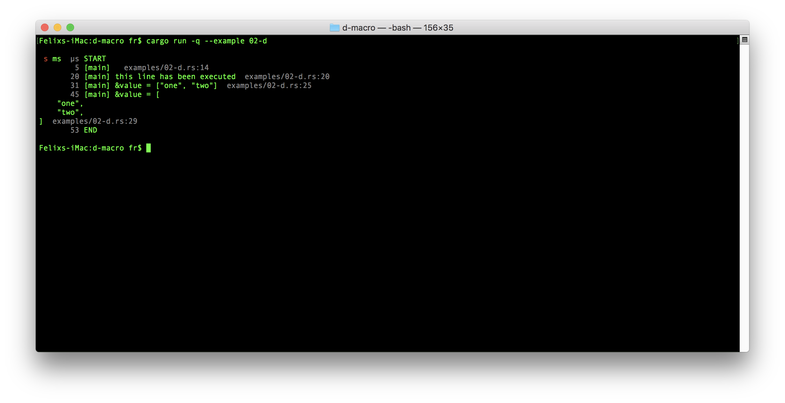

# d-macro

`d!()` is a `dbg!()`-like macro with

- more formatting options,
- microsecond timestamps,
- showing the caller's thread name.

(The `#?` variant is currently uglier than necessary, but that can be fixed
in a future version.)

## Examples

See [`examples`](./examples) for examples.

## License

Licensed under either of

-   Apache License, Version 2.0
    ([LICENSE-APACHE](LICENSE-APACHE) or <http://www.apache.org/licenses/LICENSE-2.0>)

-   MIT license
    ([LICENSE-MIT](LICENSE-MIT) or <http://opensource.org/licenses/MIT>)

at your option.

### Contribution

Unless you explicitly state otherwise, any contribution intentionally
submitted for inclusion in this crate by you, as defined in the Apache-2.0
license, shall be dual licensed as above, without any additional terms or
conditions.
